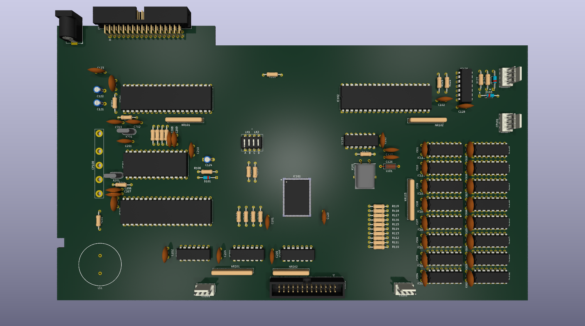

# Amstrad PCW8xxx Schematics #
This repository contains a KiCad project representing
the schematics of the main board of the Amstrad
PCW8256 and PCW8512 personal computers

The project is complete for schematics only

The PCB design holds accurate board dimensions and
mostly accurate component positions. Where a component
is a critical reference location this has been 
measured and placed as accurately as possible.

# License #
This project is licensed under Creative Commons 4 BY-SA
See LICENSE file for full statement